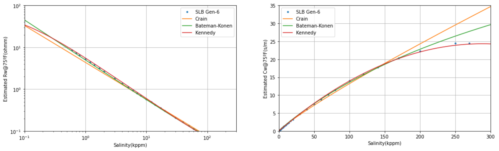

<h1>
Salinity conversions by three methods</h1>

<h2>Notebook creator</h2>

Manuel **David** Soto. MSc in Geological Sciences, University of Texas at Austin, USA.

<h2>About this notebook</h2>

Here I try to evaluate the effectiveness of three formulas to convert from salinity to water resistivity (Rw). 

<h2>Libraries for notebook</h2>

Here is a list of libraries that you need for this notebook:
  
    numpy
    matplotlib
    pandas
    scikit-learn
    openpyxl
